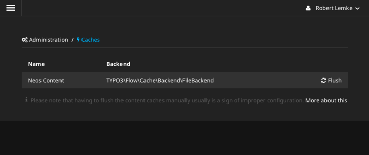

# Neos Cache Management Backend Module

This [Neos](https://www.neos.io) backend module provides cache management functions to Neos administrators who don't have access to a Flow shell. In this early version, the backend module simply allows for flushing the content cache (TYPO3_TypoScript_Content).

# Installation

Simply install this package via Composer. The package key is `flownative/neos-cachemanagement`.
